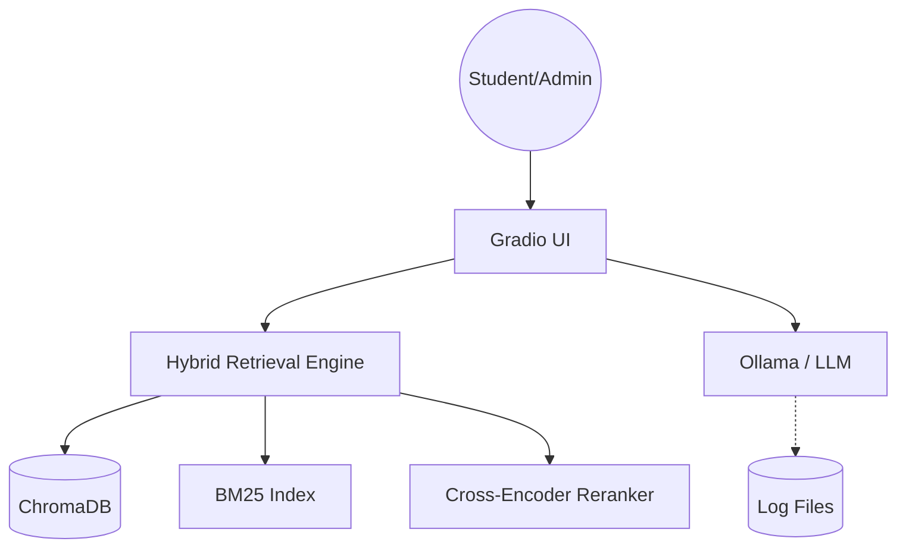
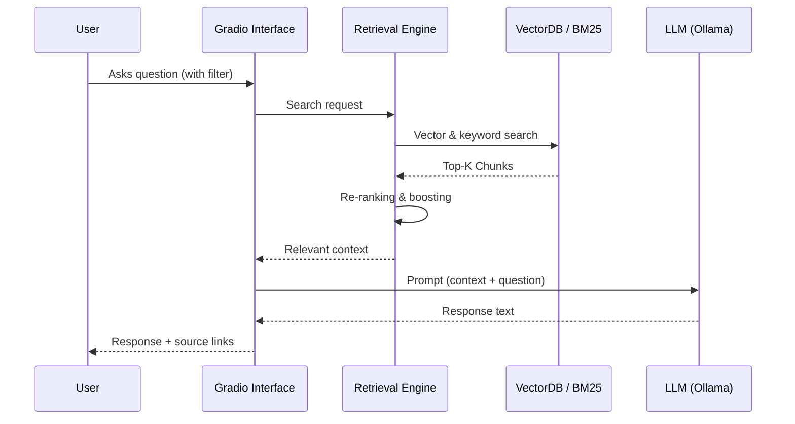
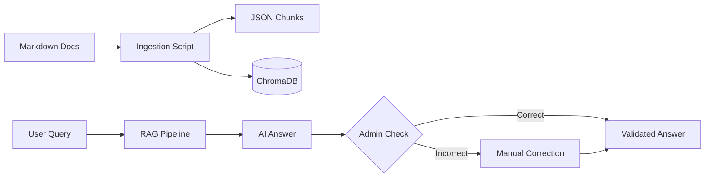

# Architecture

The PO-Chatbot follows a classic Retrieval-Augmented Generation (RAG) architecture, enhanced with hybrid search and a human-in-the-loop component.

## System Overview

The following diagram shows the interaction of the components:

## Data Flow

The data flow of a request is as follows:

## Lifecycle Process

The process of data preparation and validation:

