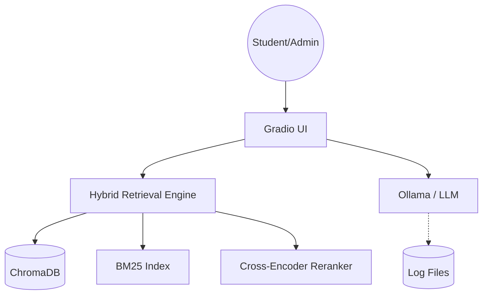
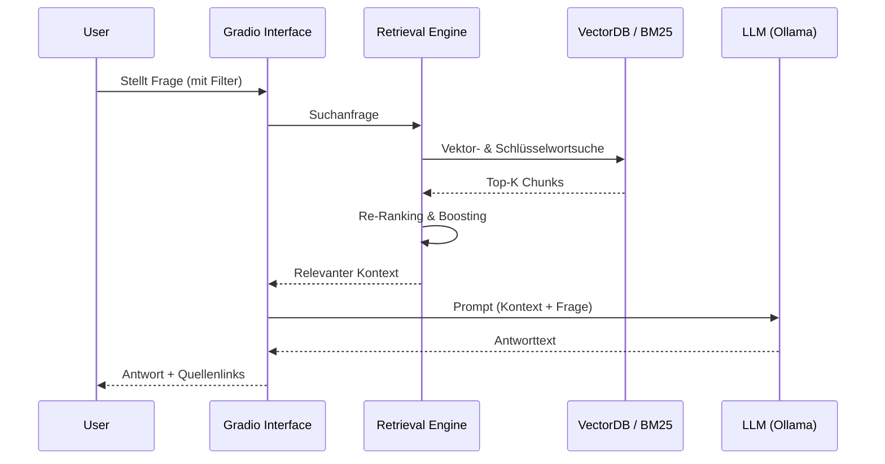
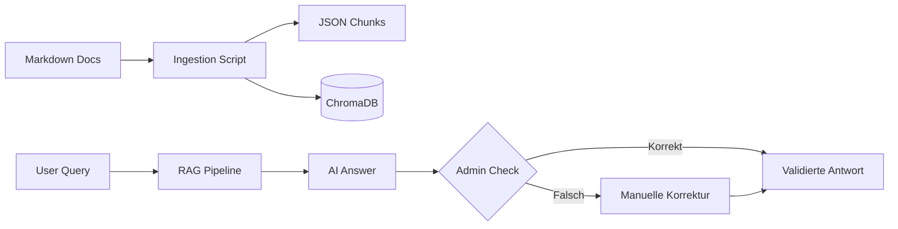

# Architektur

Der PO-Chatbot folgt einer klassischen Retrieval-Augmented Generation (RAG) Architektur, erweitert um eine hybride Suche und eine Human-in-the-Loop Komponente.

## Systemübersicht

Die folgende Grafik zeigt die Interaktion der Komponenten:

## Datenfluss

Der Datenfluss einer Anfrage sieht wie folgt aus:

## Lifecycle-Prozess

Der Prozess der Datenaufbereitung und Validierung:

